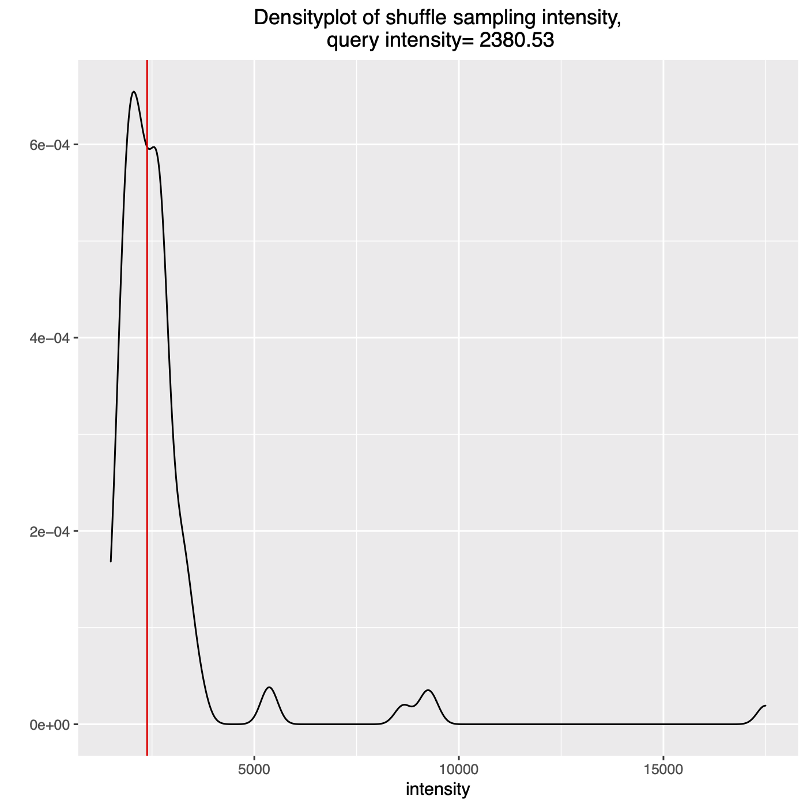

Shuffle test
=============================

The biological meaning of the extracted intensity is assessed by the probability that the intensity occurs by chance. We define a null hypothesis by shuffling a query position to estimate its probability distribution. That is, we randomly shuffle the query position many times (default=100, controlled by the *-random* option) and calculate the contact intensities. Finally, the query's contact intensity is evaluated by its ranking among the sampled intensities. You can turn off shuffle test by ``-random 0``.

We provide ``tools/visualSuffleTest.R``, a script to visualize the query's output against the random samples' distribution.
::
    hicmaptools -in_map fly_30k.n_contact -in_bin fly_30k.cbins -bat bat.bed -random 100 -output batTest.tsv
    Rscript tools/visualSuffleTest.R batTest_random_1.txt batTest_plot.pdf

The plot shows density of shuffle test and the query intensity is highlined as a red vertical line.

