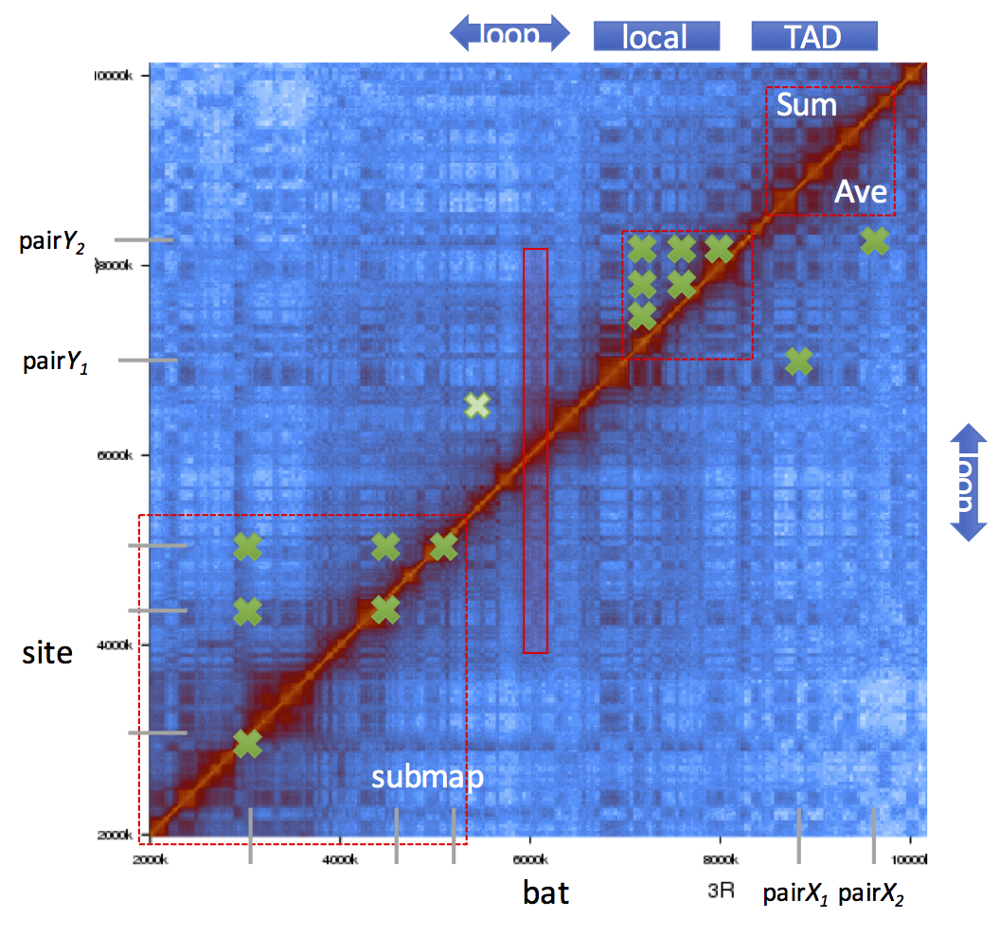

How to use HiCmappTools?
=============================

Quick start
-----

::

    hicmaptools -in_map in.binmap -in_bin in.bins QUERY_MODE query.bed -output out_file.tsv  

    input:  
            -in_map      text .n_contact or binary .bimap by genBiMap commend 
            -in_bin      the bin file for contact map, .bins
        
    QUERY_MODE: 
            -bat         calculate average contacts from downstream to upstream of interested position
        
            -local       list all contacts inside an interval

            -loop        contact intensity between two ends of a loop
            
            -pair        contacts between a pair region
            
            -sites       contacts between sites

            -submap      sub contact map of interested regions

            -TAD         sum and average of contacts inside TAD region
        
    other parameters:
            -ner_bin     check neighbouring bins for bat mode, default=10
            -random      the size of the shffule sample, default=100

Query Modes
-----------

`bed format <https://genome.ucsc.edu/FAQ/FAQformat.html#format1>`__ :
first three required columns are enough.

-bat
''''

-  calculate average contacts from downstream to upstream (controled by -ner_bin) of interested position (white rectangle)
-  i.e., PcG binding sites

-local
''''''

-  list all contacts inside an interval (white cross)
-  i.e., check intra-contacts of a TAD

-loop
'''''

-  contact intensity between two ends of a loop
-  i.e., check whether 5’ & 3’ of a gene form loop or not

-pair
'''''''

-  contacts between a pair region (contact between pair *X* and pair *Y*, white cross)
-  i.e., contact between a enhancer and a promoter

-sites
''''''

-  contact between sites (contacts between three sites, including diagonal)
-  i.e., contacts of insulator sites

-submap
'''''''

-  sub contact map of interested regions
-  i.e., extract sub contact map of 3R:10~15MB

-TAD
''''

-  sum and average of contacts inside TAD region (white dashed square at top right)
-  i.e., whether PcG/Active TADs show different contact property

Illustration of query modes

-output
'''''''

There are two output files

- specificOutput.tsv: the contact intensity of you interested
- specificOutput **_random** .tsv: the contact intensities of the null hypothesis

Command example
-------------------------

Suppose you have below files and want to query ``-bat``:

- map file : nm\_none\_30000.n\_contact
- bin file : 30000.cbins
- query input file : BATtest.txt

Then use the command
::

>hicmaptools -in_map nm_none_30000.n_contact -in_bin 30000.cbins -bat BATtest.txt -output temp.tsv
