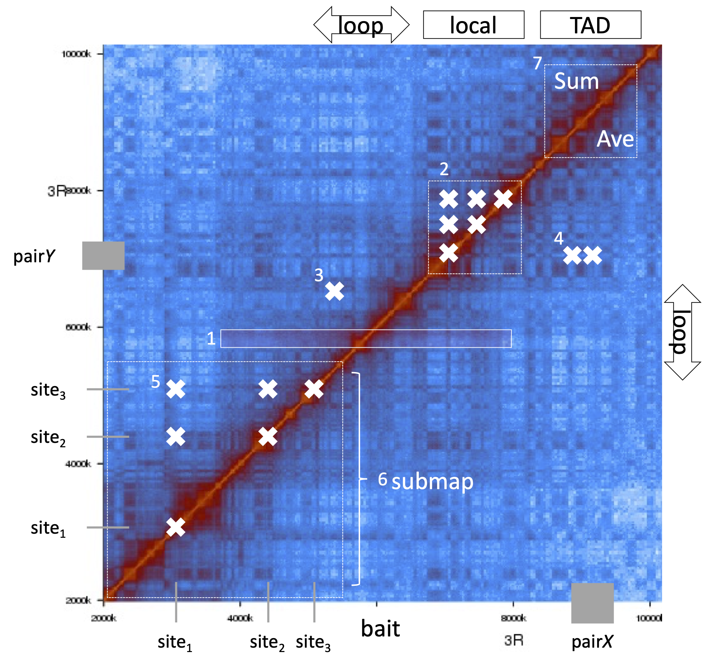

How to use HiCmapTools?
=============================

Quick start
-----

::

    hicmaptools -in_map in.binmap -in_bin in.bins QUERY_MODE query.bed -output out_file.tsv
    or
    hicmaptools -in_hic in.hic [-in_hic_norm NONE] [-in_hic_resol 10000] QUERY_MODE query.bed -output out_file.tsv
    
    input:  
            -in_map        text .n_contact or binary .bimap by genBiMap commend 
            -in_bin        the bin file for contact map, .bins
            or
            -in_hic        .hic file generated by Juicer
            -in_hic_norm   optional, a normalization method (NONE|VC|VC_SQRT|KR, default: NONE)
            -in_hic_resol  optional, a resolution used to bin .hic (default: 10000)    
        
    QUERY_MODE: 
            -bat         calculate average contacts from downstream to upstream of interested position
        
            -local       list all contacts inside an interval

            -loop        contact intensity between two ends of a loop
            
            -pair        contacts between a pair region
            
            -sites       contacts between sites

            -submap      sub contact map of interested regions

            -TAD         sum and average of contacts inside TAD region
        
    other parameters:
            -ner_bin     check neighbouring bins for bat mode, (default: 10)
            -random      the size of the shffule sample (default: 100)

Query Modes
-----------

`bed format <https://genome.ucsc.edu/FAQ/FAQformat.html#format1>`__ :
first three required columns are enough.

-bat
''''

-  calculate average contacts from downstream to upstream (controled by -ner_bin) of interested position (white rectangle)
-  i.e., PcG binding sites

-local
''''''

-  list all contacts inside an interval (white cross)
-  i.e., check intra-contacts of a TAD

-loop
'''''

-  contact intensity between two ends of a loop
-  3R   2721975 2824950 => 3R:2721975(bin11), 3R:2824950(bin17), the contact between bin11 & bin17
-  i.e., check whether 5’ & 3’ of a gene form loop or not

-pair
'''''''

-  contacts between a pair region (contact between region *X* and region *Y*, white cross)
-  3R   952484  953085  3R  1094107 1094708 => 3R:952484-953085(bin23 bin24), 3R:1094107-1094708(bin27 bin28) => the contacts of bin23& bin27, bin23&bin28, bin24&bin27 and bin24&bin28.
-  i.e., contact between a enhancer and a promoter

-sites
''''''

-  contact between sites (contacts between three sites, including diagonal)
-  i.e., contacts of insulator sites

-submap
'''''''

-  sub contact map of interested regions
-  i.e., extract sub contact map of 3R:10~15MB

-TAD
''''

-  sum and average of contacts inside TAD region (white dashed square at top right)
-  i.e., whether PcG/Active TADs show different contact property

Illustration of query modes

Command examples
-----------

BAT query
''''

Suppose you have below files and want to query ``-bat``:

- map file : `fly_30k.n\_contact <https://github.com/changlabtw/hicmaptools/blob/master/examples/fly_30k.n\_contact>`_
- bin file : `fly_30k.cbins <https://github.com/changlabtw/hicmaptools/blob/master/examples/fly_30k.cbins>`_
- query file : `bat.bed <https://github.com/changlabtw/hicmaptools/blob/master/examples/bat.bed>`_

Then use the command
::

>hicmaptools -in_map fly_30k.n_contact -in_bin fly_30k.cbins -bat bat.bed -output batTest.tsv

More queries
''''
There are two scripts, `runExamples4bincontact.sh <https://github.com/changlabtw/hicmaptools/blob/master/examples/runExamples4bincontact.sh>`_ and `runExamples4hic.sh <https://github.com/changlabtw/hicmaptools/blob/master/examples/runExamples4hic.sh>`_, to run all query modes for bin-contact and hic inputs, respectively.
::

>runExamples4bincontact.sh
>runExamples4hic.sh

TAD loop in the manuscript
''''

We calculate the contact intensity between two boundaries of the TADs via the loop query mode

- map file (binary format): `fly.binmap <https://figshare.com/s/1e045bbab7b6c5e3e880>`_
- bin file : `fly.bins <https://figshare.com/s/1e045bbab7b6c5e3e880>`_
- query file : `epiTAD.bed <https://figshare.com/s/1e045bbab7b6c5e3e880>`_

::

>hicmaptools -in_map fly.bimap -in_bin fly.bins -loop epiTAD.bed -random 1 -output TADloop_cm_10k_top5.tsv &> TADloop.log
>Rscript plot_TADLoop.R

TAD intra-density in the manuscript
''''

We check whether intra-TAD contact intensity also shows differently across epi-classes via the TAD query mode

- map file (binary format): `fly.binmap <https://figshare.com/s/1e045bbab7b6c5e3e880>`_
- bin file : `fly.bins <https://figshare.com/s/1e045bbab7b6c5e3e880>`_
- query file : `epiTAD.bed <https://figshare.com/s/1e045bbab7b6c5e3e880>`_

::

>hicmaptools -in_map fly.bimap -in_bin fly.bins -TAD epiTAD.bed -random 0 -output TADintra_cm_10k_top5.tsv &> TADintra.log
>Rscript plot_TADintra.R
